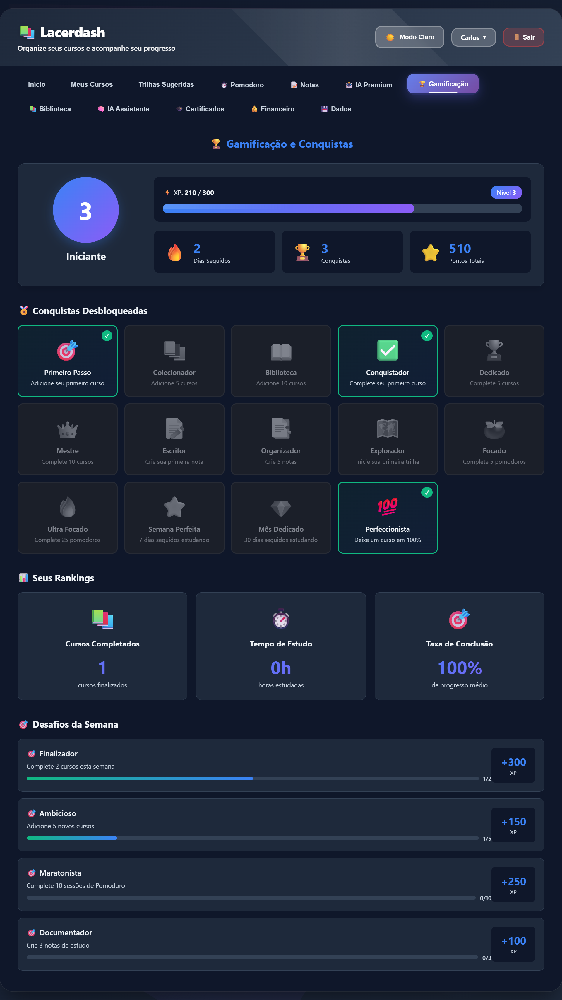

# 📚 Lacerdash - Sistema Completo de Gestão de Estudos

<div align="center">


[](https://lacerdash.netlify.app/)

**Plataforma web completa para organização, acompanhamento e gamificação do aprendizado pessoal**

### 🌐 [**Acesse a Aplicação →**](https://lacerdash.netlify.app/)

[📖 Documentação](#-funcionalidades-detalhadas) • [🚀 Demo](#-demonstração) • [💻 Instalação](#-instalação) • [🤝 Contribuir](#-contribuindo)

</div>

---

## 🎯 Sobre o Projeto

O **Lacerdash** é uma aplicação web moderna e completa desenvolvida para ajudar estudantes e profissionais a organizarem seus cursos, acompanharem seu progresso de aprendizado e manterem-se motivados através de gamificação e ferramentas inteligentes.

> 🚀 **Acesse agora**: [lacerdash.netlify.app](https://lacerdash.netlify.app/)

### ✨ Principais Características

- 📊 **Dashboard Interativo** com estatísticas em tempo real
- 🎮 **Sistema de Gamificação** completo (XP, níveis, conquistas, desafios)
- 📝 **Editor de Notas** com suporte a Markdown
- ⏱️ **Timer Pomodoro** integrado para sessões de estudo
- 🎯 **Trilhas de Aprendizado** guiadas e personalizadas
- 🤖 **IA Assistente** com recomendações inteligentes
- 💰 **Gestão Financeira** de investimentos em cursos
- 🏆 **Sistema de Certificados** automático
- 📚 **Biblioteca de Recursos** organizada
- 💾 **Backup Automático** com versionamento
- 🎨 **Personalização Avançada** (temas, cores, layouts)
- 🌐 **100% Offline** - dados salvos localmente

---

## 🚀 Demonstração

### 🌐 Aplicação Online

**Experimente agora sem instalar**: [https://lacerdash.netlify.app/](https://lacerdash.netlify.app/)

---

### 📊 Dashboard Principal


*Acompanhe todas as suas estatísticas de aprendizado em tempo real com gráficos interativos e cards informativos.*

---

### 🏆 Sistema de Gamificação


*Sistema completo de XP, níveis, conquistas e desafios para manter você motivado nos estudos.*

---

### 📝 Sistema de Notas


*Editor de notas com suporte completo a Markdown, visualização em tempo real e organização inteligente.*

---

## 🛠️ Tecnologias Utilizadas

<table>
<tr>
<td align="center" width="25%">

<br><strong>HTML5</strong>
<br><sub>Estrutura</sub>
</td>
<td align="center" width="25%">

<br><strong>CSS3</strong>
<br><sub>Estilização</sub>
</td>
<td align="center" width="25%">

<br><strong>JavaScript</strong>
<br><sub>Lógica</sub>
</td>
<td align="center" width="25%">

<br><strong>Chart.js</strong>
<br><sub>Gráficos</sub>
</td>
</tr>
</table>

### Bibliotecas Externas
- [Chart.js](https://www.chartjs.org/) `v4.4.0` - Gráficos interativos
- [Marked.js](https://marked.js.org/) - Parser de Markdown
- [Tesseract.js](https://tesseract.projectnaptha.com/) `v5.0` - OCR (reconhecimento de texto)
- [jsPDF](https://github.com/parallax/jsPDF) `v2.5.1` - Geração de PDFs
- [html2canvas](https://html2canvas.hertzen.com/) `v1.4.1` - Captura de tela

### Hospedagem
- **Netlify** - Deploy contínuo e hospedagem gratuita

### Armazenamento
- **LocalStorage API** - Persistência de dados no navegador

---

## 📋 Funcionalidades Detalhadas

### 1. 📚 Gestão de Cursos
- ✅ Adicionar/editar/deletar cursos
- ✅ Múltiplas categorias e plataformas
- ✅ Acompanhamento de progresso (0-100%)
- ✅ Status: Não Iniciado, Em Andamento, Pausado, Concluído
- ✅ Videoaulas do YouTube integradas
- ✅ Sistema de anotações por curso
- ✅ Filtros avançados (categoria, status, busca)

### 2. 🎮 Sistema de Gamificação
- ⚡ **XP e Níveis**: Ganhe experiência ao completar ações
- 🏆 **14 Conquistas**: Desbloqueie badges especiais
- 🔥 **Sistema de Streak**: Mantenha dias consecutivos de estudo
- 🎯 **Desafios Semanais**: Metas com recompensas em XP
- 📊 **Rankings Pessoais**: Acompanhe suas estatísticas

### 3. 📝 Sistema de Notas
- ✏️ Editor com suporte completo a **Markdown**
- 👁️ Visualização em tempo real
- 🔍 Busca integrada
- 📅 Controle de versões (data de criação/edição)
- 💾 Salvamento automático

### 4. ⏱️ Timer Pomodoro
- 🍅 **Técnica Pomodoro** clássica (25/5/15 min)
- ⚙️ Configurações personalizáveis
- 📊 Histórico de sessões
- 🔔 Notificações sonoras
- 📈 Estatísticas de produtividade

### 5. 🎯 Trilhas de Aprendizado
- 📚 Trilhas pré-definidas por categoria
- 🗺️ Sistema de progresso visual
- ✅ Marcação de cursos completos
- 🎓 Recomendações personalizadas baseadas em seu perfil

### 6. 🤖 IA Assistente
- 🎯 **Análise de Perfil**: Tipo de aprendiz, velocidade, consistência
- 💡 **Recomendações Inteligentes**: Sugestões personalizadas
- 📅 **Plano de Estudos**: Geração automática de cronograma semanal
- 🔮 **Insights e Previsões**: Análise preditiva de conclusão
- 🚀 **Dicas de Melhoria**: 5 técnicas de estudo comprovadas

### 7. 💰 Gestão Financeira
- 💵 Controle de investimento em cursos
- 🛒 Wishlist com alertas de promoção
- 📊 Gráficos de gastos por categoria
- 📄 Emissão de notas fiscais (formato cupom térmico)
- 💹 Cálculo de ROI por curso

### 8. 🏆 Sistema de Certificados
- 🎓 Geração automática ao atingir 100%
- 🎉 Modal de conquista animado
- 📥 Download em PNG de alta qualidade
- 📤 Compartilhamento em redes sociais
- 🔒 Código único de autenticação

### 9. 📚 Biblioteca de Recursos
- 🔗 Links, PDFs, vídeos, artigos
- 🏷️ Sistema de tags
- 🔍 Filtros por curso e tipo
- 📝 Descrições detalhadas

### 10. 💾 Backup e Versionamento
- 🔄 **Backup Automático**: A cada alteração importante
- 📜 **Histórico de Versões**: Últimas 10 versões salvas
- ⏮️ **Restauração**: Volte para qualquer versão anterior
- 📊 **Comparação**: Visualize diferenças entre versões
- 📤 **Exportação Manual**: JSON e PDF

### 11. 🎨 Personalização
- 🌓 **Temas**: Claro e Escuro
- 🎨 **6 Cores Principais**: Blue, Purple, Pink, Green, Orange, Red
- 📐 **3 Layouts**: Normal, Compacto, Detalhado
- ✨ **Toggle de Animações**: Ative/desative efeitos
- 🌊 **Toggle de Efeitos Visuais**: Controle total da experiência

### 12. 🤖 Ferramentas IA Premium
- 📝 **Gerador de Resumos**: 3 tamanhos (curto/médio/longo)
- 📷 **OCR**: Extração de texto de imagens (Português)
- 💾 **Integração com Notas**: Salve resultados diretamente

---

## 📦 Instalação

### 🌐 Opção 1: Usar Online (Recomendado)

Acesse diretamente sem instalar nada:
### **[https://lacerdash.netlify.app/](https://lacerdash.netlify.app/)**

---

### 💻 Opção 2: Instalação Local

#### Requisitos
- Navegador moderno (Chrome, Firefox, Edge, Safari)
- Conexão com internet (apenas para carregar bibliotecas CDN)

#### Passos

1. **Clone o repositório**
```bash
git clone https://github.com/seu-usuario/lacerdash.git
cd lacerdash
```

2. **Abra o arquivo HTML**
```bash
# Opção 1: Abrir diretamente no navegador
# Dê dois cliques no arquivo index.html

# Opção 2: Usar servidor local (recomendado)
# Com Python 3
python -m http.server 8000

# Com Node.js (npx)
npx serve

# Com PHP
php -S localhost:8000
```

3. **Acesse no navegador**
```
http://localhost:8000
```

---

## 🎮 Como Usar

### Primeiro Acesso

1. **Acesse a Aplicação**
   - Online: [https://lacerdash.netlify.app/](https://lacerdash.netlify.app/)
   - Local: Abra o arquivo `index.html`

2. **Faça Login**
   - Digite seu nome na tela inicial
   - Seus dados serão salvos localmente

3. **Adicione Seu Primeiro Curso**
   - Clique em "Meus Cursos" → "Adicionar Novo Curso"
   - Preencha: Nome, Categoria, Plataforma, Status, Progresso
   - Adicione anotações e videoaulas (opcional)

4. **Explore as Funcionalidades**
   - **Pomodoro**: Inicie uma sessão de estudo focado
   - **Notas**: Crie resumos dos seus cursos
   - **Trilhas**: Siga um caminho de aprendizado guiado
   - **Gamificação**: Acompanhe seu progresso e conquistas

### Dicas de Uso

💡 **Mantenha o Streak**: Acesse diariamente para manter dias consecutivos

🎯 **Use Trilhas**: Siga trilhas para ter um caminho estruturado

⏱️ **Pomodoro**: Use para aumentar foco (25 min estudo + 5 min pausa)

📝 **Faça Anotações**: Melhora retenção em 34%

💾 **Ative Backup Automático**: Proteja seus dados

---

## 📊 Estrutura de Dados

### LocalStorage Keys

```javascript
// Dados principais
`cursos_{usuario}` // Array de cursos
`notas_{usuario}` // Array de notas
`recursos_{usuario}` // Array de recursos
`gamificacao_{usuario}` // Dados de XP, níveis, conquistas
`trilha_ativa_{usuario}` // Trilha em progresso
`financeiro_{usuario}` // Dados financeiros

// Configurações
`theme_{usuario}` // Tema (light/dark)
`personalizacoes_{usuario}` // Cor, layout, animações
`backup_auto_{usuario}` // Status backup automático
`historico_versoes_{usuario}` // Últimas 10 versões

// Temporários
`pomodoro_config_{usuario}` // Configurações Pomodoro
`pomodoro_hoje_{usuario}_{data}` // Sessões do dia
```

### Estrutura de Curso

```javascript
{
  id: 1234567890,
  nome: "JavaScript Avançado",
  categoria: "Programação",
  plataforma: "Udemy",
  status: "em-andamento", // nao-iniciado | em-andamento | pausado | concluido
  progresso: 65, // 0-100
  anotacoes: "Curso excelente sobre closures...",
  videoaulas: [
    {
      id: "dQw4w9WgXcQ",
      url: "https://youtube.com/watch?v=...",
      thumbnail: "https://img.youtube.com/vi/.../mqdefault.jpg",
      titulo: "Videoaula"
    }
  ],
  certificado: { /* objeto se progresso = 100% */ },
  dataInicio: "25/11/2024",
  dataUltimaAtualizacao: "26/11/2024"
}
```

---

## 🎨 Personalização

### Temas

```css
/* Light Mode */
--bg-primary: #ffffff;
--text-primary: #1e293b;

/* Dark Mode */
--bg-primary: #1e293b;
--text-primary: #f1f5f9;
```

### Cores Principais

- 🔵 **Blue** (Padrão)
- 🟣 **Purple**
- 🌸 **Pink**
- 🟢 **Green**
- 🟠 **Orange**
- 🔴 **Red**

### Layouts

- **Normal**: Espaçamento padrão, ideal para a maioria
- **Compacto**: Mais cursos visíveis, menos padding
- **Detalhado**: Mais informações, cards maiores

---

## 🏆 Sistema de Conquistas

| Conquista | Descrição | XP |
|-----------|-----------|-----|
| 🎯 Primeiro Passo | Adicione seu primeiro curso | 50 |
| 📚 Colecionador | Adicione 5 cursos | 100 |
| 📖 Biblioteca | Adicione 10 cursos | 200 |
| ✅ Conquistador | Complete seu primeiro curso | 100 |
| 🏆 Dedicado | Complete 5 cursos | 250 |
| 👑 Mestre | Complete 10 cursos | 500 |
| 📝 Escritor | Crie sua primeira nota | 50 |
| 📑 Organizador | Crie 5 notas | 100 |
| 🗺️ Explorador | Inicie sua primeira trilha | 75 |
| 🍅 Focado | Complete 5 pomodoros | 150 |
| 🔥 Ultra Focado | Complete 25 pomodoros | 300 |
| ⭐ Semana Perfeita | 7 dias seguidos estudando | 200 |
| 💎 Mês Dedicado | 30 dias seguidos estudando | 1000 |
| 💯 Perfeccionista | Deixe um curso em 100% | 150 |

---

## 🔒 Privacidade e Segurança

- ✅ **100% Local**: Todos os dados salvos no navegador
- ✅ **Sem Servidor**: Nenhuma informação enviada externamente
- ✅ **Sem Registro**: Não requer email ou senha
- ✅ **Seus Dados, Seu Controle**: Exporte a qualquer momento
- ⚠️ **Atenção**: Limpar cache do navegador apaga os dados

---

## 🗺️ Roadmap

### v2.1.0 (Próximo)
- [ ] Modo de revisão espaçada (Spaced Repetition)
- [ ] Integração com Google Calendar
- [ ] Exportação para Notion/Obsidian
- [ ] Modo colaborativo (compartilhar trilhas)
- [ ] Estatísticas avançadas (gráficos de tempo)

### v2.2.0 (Futuro)
- [ ] Sincronização em nuvem (Firebase)
- [ ] App mobile (PWA)
- [ ] Integração com plataformas de curso (API)
- [ ] Sistema de metas SMART
- [ ] Modo de grupos de estudo

---

## 🤝 Contribuindo

Contribuições são sempre bem-vindas! Para contribuir:

1. Fork o projeto
2. Crie uma branch para sua feature (`git checkout -b feature/NovaFeature`)
3. Commit suas mudanças (`git commit -m 'Adiciona NovaFeature'`)
4. Push para a branch (`git push origin feature/NovaFeature`)
5. Abra um Pull Request

### Diretrizes

- Mantenha o código limpo e comentado
- Teste todas as funcionalidades
- Atualize a documentação se necessário
- Siga os padrões de código existentes

---

## 📄 Licença

Este projeto está sob a licença MIT. Veja o arquivo [LICENSE](LICENSE) para mais detalhes.

```
MIT License

Copyright (c) 2024 Lacerdash

Permission is hereby granted, free of charge, to any person obtaining a copy
of this software and associated documentation files (the "Software"), to deal
in the Software without restriction...
```

---

## 👨‍💻 Autor

**Seu Nome**

- GitHub: [@carloslacerda](https://github.com/CarlosLacerda)
- LinkedIn: [Carlos Lacerda]([https://linkedin.com/in/seu-perfil](https://www.linkedin.com/in/carlos-lacerda-972652394/))
- Email: 

---

## 🙏 Agradecimentos

- [Chart.js](https://www.chartjs.org/) - Gráficos lindos e responsivos
- [Marked.js](https://marked.js.org/) - Parser Markdown rápido
- [Tesseract.js](https://tesseract.projectnaptha.com/) - OCR em JavaScript
- [jsPDF](https://github.com/parallax/jsPDF) - Geração de PDFs no client-side
- [Netlify](https://www.netlify.com/) - Hospedagem gratuita e deploy contínuo
- Comunidade open-source por inspiração e feedback

---

## 📞 Suporte

Encontrou um bug? Tem uma sugestão?

- 🐛 [Abra uma Issue](https://github.com/seu-usuario/lacerdash/issues)
- 💬 [Discussões](https://github.com/seu-usuario/lacerdash/discussions)
- 🌐 [Aplicação Online](https://lacerdash.netlify.app/)
- 📧 Email: 

---

## ⭐ Mostre seu apoio

Se este projeto te ajudou, considere dar uma ⭐ no repositório!

---

<div align="center">

### 🚀 **[Experimente Agora →](https://lacerdash.netlify.app/)**

**Feito com ❤️ e muito ☕**

[⬆ Voltar ao topo](#-lacerdash---sistema-completo-de-gestão-de-estudos)

</div>
